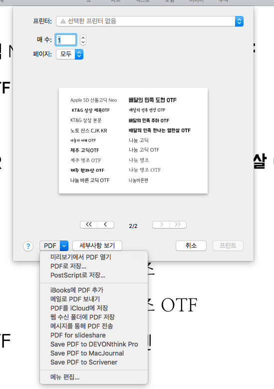
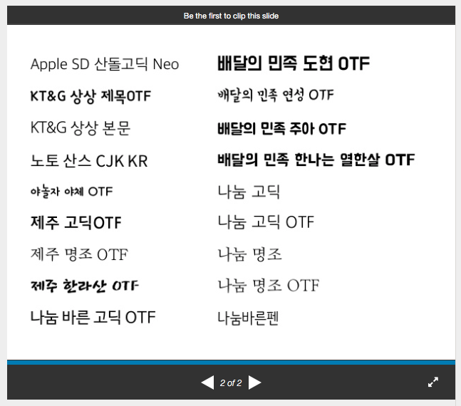

# pdfForSlideshare

macOS에서 slideshare.net에 올릴 PDF 파일을 만들 때 사용하는 프린트 플러그인입니다.

keynote에서 한글 폰트를 사용하여 PDF 파일로 만들어 slideshare.net에 올리면 한글이 안보이는 경우를 해결합니다. 자세한 내용은 https://item4.github.io/2016-10-31/Way-to-Use-Homeland-Fonts-on-SlideShare/ 을 봐주세요.

# 설치

```
$ . ./install.sh
```

# 사용법

설치 후, 각종 응용프로그램의 프린트에서 추가된 것을 확인할 수 있습니다.



slideshare.net에 올리면 이렇게 잘 나옵니다.


